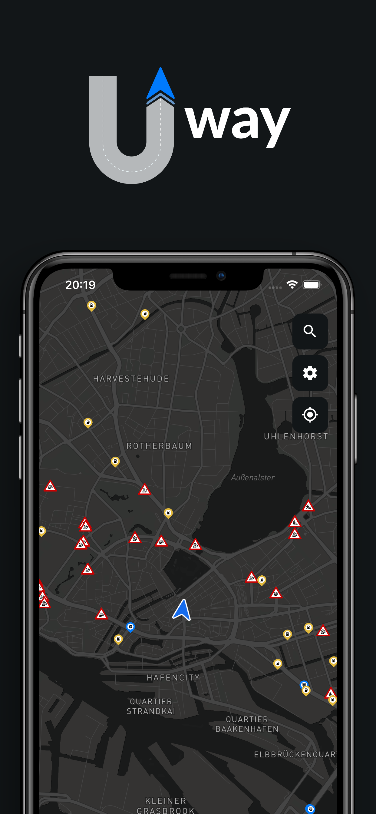
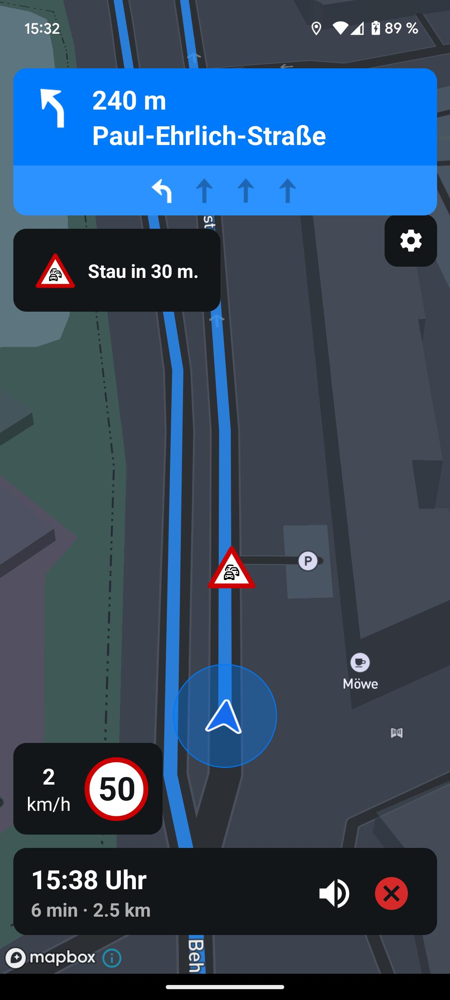
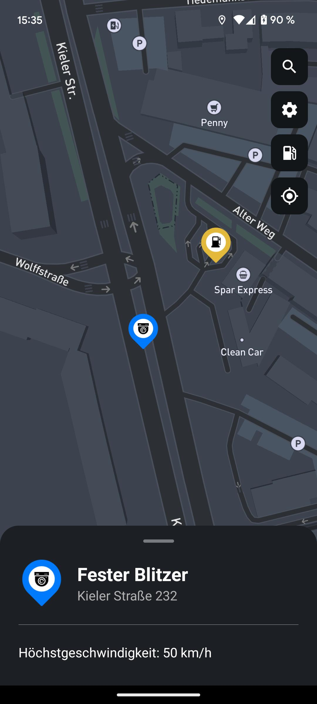
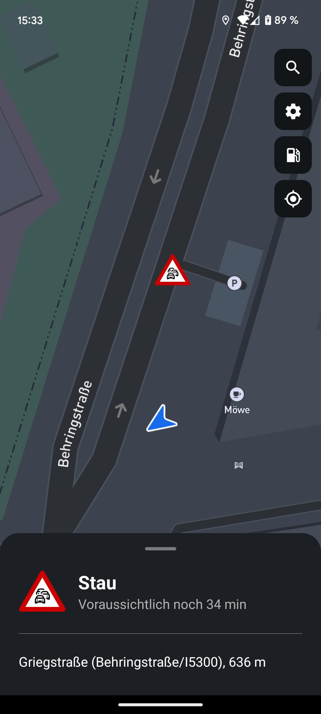
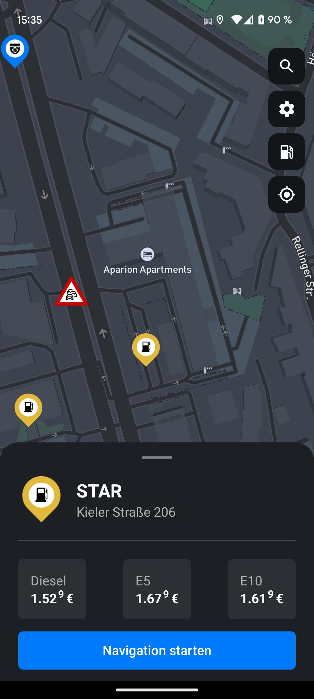
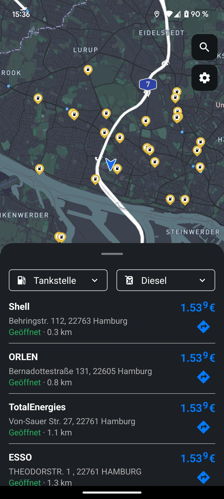
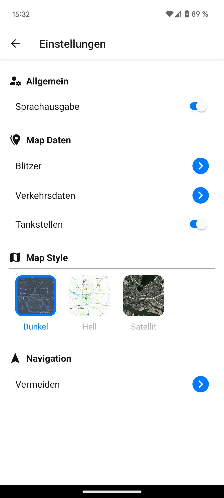

# Uway

React Native navigation app providing speed camera warnings, real-time traffic data, gas station information, and turn-by-turn navigation with TTS instructions.



## Screenshots

<div style="display: grid; grid-template-columns: repeat(3, 1fr); gap: 15px; max-width: 650px;">
  
  
  
  
  
  
</div>

## Architecture

The app consists of three main components:

- **[Backend](https://github.com/Fuggel/Uway-Backend)**: REST API for directions, search, gas stations, speed cameras, incidents, auth, and WebSocket Warning Manager
- **React Native**: UI, Mapbox integration, and navigation state management
- **Native Modules**: Background GPS tracking, WebSocket communication, and TTS handling (`/ios` and `/android` directories)

For detailed information about native module integration and workflow, see the [workflow](docs/workflow.md).


## Features

- **Speed Camera Warnings**: Real-time alerts with speed limit information based on GPS location
- **Turn-by-Turn Navigation**: Background GPS tracking with TTS instructions and route optimization
- **Traffic Data**: Live incident warnings and hazard notifications via WebSocket
- **Gas Station Finder**: Real-time fuel prices and station information
- **Location Search**: Autocomplete search with detailed location information
- **Premium Paywall**: RevenueCat integration for subscription management
- **Customizable Settings**: Map style configuration, navigation type exclusions, and map layer filtering
- **Background Services**: Native modules for continuous GPS tracking and WebSocket communication

## Tech Stack

- **React Native** with Expo Bare Workflow
- **Expo Router** for file-based navigation
- **Redux Toolkit** + Redux Persist for state management
- **Mapbox Maps** (custom fork) for mapping functionality
- **Socket.IO** for real-time communication
- **RevenueCat** for subscription management and paywall
- **Swift/Kotlin Native Modules** for background services
- **React Native Paper** for UI components

## Quick Setup

```bash
# Install dependencies
npm install

# Copy environment template and adjust as needed
cp .env.example .env.development

# Start development server
npm start

# Run on device
npx expo run:ios --device      # iOS device
npx expo run:android --device  # Android device
```

## Build & Deploy

```bash
# Install EAS CLI
npm install -g @expo/eas-cli

# Build for development
eas build --profile development

# Build for production
eas build --profile production
```
