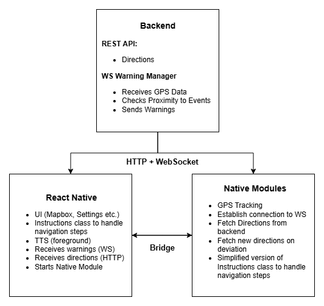

# Native Modules Workflow

## Project Scope: Native Modules for Navigation App

This document outlines how the native module should behave within the app.

## Architecture



## Overview

- Background GPS tracking
- WebSocket communication with backend
- Directions fetching from backend
- Navigation state management (route following, rerouting)
- Local TTS and notification handling (for both instructions and warnings that are received via WS)

## Navigation Workflow

### 1. Navigation Start

- React Native starts the native modules and sends all relevant params for directions api:

    ```js
    NativeModules.NavService.start(params);
    ```

- Native Modules should:
    - Set up necessary background services
    - Establish WebSocket connection and emit the infos needed
    - Fetch directions from backend via REST API
    - Start background GPS tracking
    - Detect route deviation and handle rerouting
    - Begin emitting instructions and warnings via:
        - TTS
        - Local notifications

### 2. Navigation Stop

- React Native calls:

    ```js
    NativeModules.NavService.stop();
    ```

- Native Modules should:
    - Stop and shutdown all native services

### 3. Backend API

#### Get Directions

Retrieve route directions based on the provided start and destination coordinates.

- **Method**: `GET`
- **URL**: `https://uw-backend.com/api/directions?profile=profileType&startCoordinates=lon,lat&destinationCoordinates=lon,lat&excludeTypes=type`
- **Parameters**:
    - `profile`: The type of routing profile (e.g., `driving`, `walking`, `cycling`).
    - `startCoordinates`: Longitude and latitude of the starting point.
    - `destinationCoordinates`: Longitude and latitude of the destination.
    - `excludeTypes` (optional): Road types to exclude from routing (e.g., `toll`, `highway`).
- **Response**:
    - Returns a FeatureCollection JSON with the route details, including step-by-step directions.

#### Warning Manager

Enables real-time alerts for incidents and speed cameras based on the user's live location.

##### Emit: `user-location`

Send periodically (e.g., every 2 seconds) while navigation is active.

- **Payload**:

    ```ts
    {
        eventType: "incident" | "speed-camera";
        lon: number;
        lat: number;
        heading: number;
        speed: number;
        userId: string;
        eventWarningType: string | null;
    }
    ```

- **Example**:

    ```ts
    {
        eventType: "speed-camera",
        lon: 13.405,
        lat: 52.52,
        heading: 170,
        speed: 65,
        userId: "XYZ123",
        eventWarningType: null
    }
    ```

Send one user-location event periodically per event type (incident, speed-camera).

##### Listen: `warning-manager`

The backend responds with a warning when the user is near a relevant event.

- **Response Payload**:

    ```ts
    {
        warningType: "incident" | "speed-camera";
        warningState: "early" | "late";
        eventWarningType: string;
        textToSpeech: string;
        text: string;
    }
    ```

- **Example**:

    ```ts
    {
        warningType: "speed-camera",
        warningState: "early",
        eventWarningType: "fixed",
        textToSpeech: "Fixed speed camera in 300 meters.",
        text: "Fixed speed camera in 300 m."
    }
    ```
